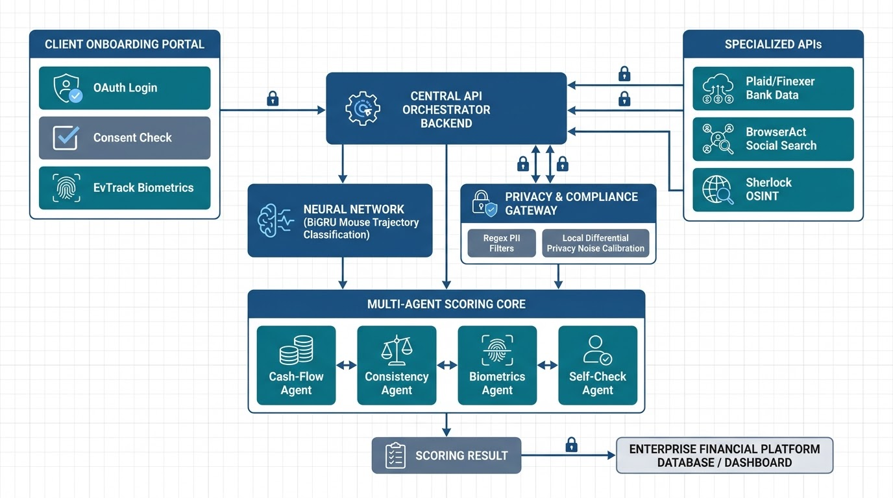

# AIDUS - AI-Driven Dynamic Underwriting System

[](LICENSE)
[]()

> A modern, privacy-first credit scoring engine that uses **Open Banking data**, **Digital Footprints (OSINT)**, and **Behavioral Biometrics** to assess credit risk fairly and accurately.

---

## 📌 What is AIDUS?

Traditional credit scoring relies heavily on historical credit bureau scores. This leaves behind freelancers, young professionals, and gig workers who lack extensive credit histories.

**AIDUS solves this by evaluating 4 real-time data sources:**

1. 🏦 **Open Banking Data:** Verifies real income, cash flows, and monthly savings habits.
2. 🌐 **Digital Footprint (OSINT):** Confirms identity longevity across online networks.
3. 🖱️ **Behavioral Biometrics:** Uses machine learning to analyze mouse movements and catch bots.
4. 🔒 **Privacy Guardrails:** Redacts personal identifiers and adds privacy noise before evaluation.

---

## 🏗️ System Architecture

AIDUS is built as a microservice architecture with a frontend application, a FastAPI backend, 5 specialized AI agents, machine learning models, and privacy guardrails.



### Full Architecture Blueprint
.png)

---

## 🔄 End-to-End Underwriting Workflow

Here is how an application moves through the system from start to finish:


### Step-by-Step Flow:
1. **Form Submission & Tracking:** The user fills out the loan form while `evtrack.js` records mouse movements in the background.
2. **Open Banking Consent:** The user authorizes bank access via a secure, credential-free bank consent page.
3. **Privacy Anonymization:** Personal details (Aadhaar, PAN, phone) are redacted, and protected attributes (age, sex, caste) are excluded.
4. **Parallel Agent Processing:** Cashflow, OSINT, and Biometrics agents analyze their respective data in parallel.
5. **Self-Check & Audit:** The Self-Check agent verifies rule consistency, confidence levels, and cost metrics.
6. **Decision & Explanation:** The final decision (**APPROVED**, **DENIED**, or **REVIEW_REQUIRED**) is produced with plain-English rationales.

---

## 🌐 How We Verify Online Presence (OSINT Scenario)

To verify that an applicant is a genuine person (not a synthetic identity or bot), AIDUS runs an automated Open-Source Intelligence (OSINT) pipeline:

```
[Applicant Form] ➔ [Sherlock Docker Container] ➔ [HaveIBeenPwned API] ➔ [Digiverifier ID Check] ➔ [Section 65B PDF]
```

### 1. Username Network Depth (Sherlock Docker Container)
- AIDUS launches an isolated Docker container running **Sherlock**.
- It scans **400+ online platforms** (GitHub, StackOverflow, Twitter, Medium, LinkedIn, etc.) for the applicant's username.
- **Why this matters:** Real applicants have organic footprints across multiple sites over several years. Synthetic identities usually exist on 0 or 1 platform.

### 2. Email Footprint Longevity ("The Longevity Paradox")
- The system checks the applicant's email against breach databases.
- **The Longevity Paradox:** An email appearing in a data breach from 5 years ago **proves** the identity is authentic and established. A brand new email created 10 minutes before applying raises risk flags.

### 3. Professional Consistency Checking
- Public developer profiles (GitHub / StackOverflow) are scraped.
- The system checks if declared technical roles match actual public code activity and skill profiles.

### 4. Government & Employment Verification (Digiverifier)
- Verifies government IDs (PAN, Aadhaar) and cross-checks **UAN (Universal Account Number)** provident fund records.
- Confirms employer name and salary consistency to prevent employment fraud.

### 5. Section 65B Legal Evidence Certification
- Every OSINT scan generates an official **Section 65B PDF Certificate** (compliant with the Indian Evidence Act / BSA 2023).
- Each certificate is stamped with a **SHA-256 cryptographic hash** for court admissibility and data auditability.

---

## 🤖 The 5 Specialized AI Agents

AIDUS uses a multi-agent system built on **LangGraph**. Each agent specializes in a specific evaluation area:

| Agent | Icon | Main Role | Decision Weight |
|-------|------|-----------|-----------------|
| **Cashflow Agent** | 🏦 | Evaluates financial transactions, income stability, monthly savings rate, and debt-to-income ratio. | **35%** |
| **OSINT Agent** | 🌐 | Evaluates username network depth, email breach history, and employment consistency. | **25%** |
| **Biometrics Agent** | 🖱️ | Interprets mouse trajectory curves and device fingerprints using ML models to catch bots. | **25%** |
| **Self-Check Agent** | ⚖️ | Pure logic auditor (no LLM). Checks business rules, cost per query, and flags conflicting outputs. | **15% modifier** |
| **Explainability Agent** | 📝 | Converts complex risk weights into plain-language summaries for applicants and regulators. | *Output Layer* |

### Decision Thresholds:
- **Risk Score < 0.40:** `APPROVED` (Low risk)
- **Risk Score 0.40 - 0.70:** `REVIEW_REQUIRED` (Sent to human underwriter)
- **Risk Score > 0.70:** `DENIED` (High risk)

---

## 🧠 Machine Learning Models

AIDUS uses a dual-model ensemble to evaluate client-side mouse trajectory physics:

### 1. BiGRU Bot Detector (PyTorch)
- **Architecture:** 2-Layer Bidirectional Gated Recurrent Unit (GRU) + Dense Layers + Sigmoid.
- **Input:** 200 time-steps of mouse movements `[x, y, time, velocity, acceleration, jerk]`.
- **Purpose:** Identifies natural human motor control (curved trajectories, micro-pauses) versus robotic straight-line movements.

### 2. Random Forest Kinetic Classifier (scikit-learn)
- **Architecture:** 200 Decision Trees.
- **Features:** Mean velocity, max velocity, mean acceleration, jitter, path straightness, pause count, and click count.
- **Purpose:** Evaluates session-level physical movement statistics.

### Ensemble Combination:
$$\text{Bot Probability} = (0.60 \times \text{BiGRU Score}) + (0.40 \times \text{Random Forest Score})$$

---

## 🔒 Privacy & Compliance Guardrails

AIDUS strictly enforces privacy regulations (DPDP Act & GDPR) before any data is sent to AI models:

- 🛡️ **PII Redaction:** 11 regex patterns remove Aadhaar numbers, PAN, phone numbers, and email addresses.
- 🚫 **Minor Exclusion Filter:** Filters out protected characteristics (age, sex, caste, religion) to prevent credit score bias.
- 🎲 **Local Differential Privacy (LDP):** Adds Gaussian noise to numerical inputs so individual data points cannot be reverse-engineered.
- 📊 **Privacy Budget Tracking:** Enforces a maximum privacy budget ($\epsilon \le 10.0$) per applicant to prevent data leaks.

---

## 🚀 Quick Start Guide

### Option 1: Run with Docker (Recommended)

Start all services (Frontend, Backend, PostgreSQL, Redis) with a single command:

```bash
docker-compose up
```

Access the services:
- **Frontend Application:** http://localhost:5500
- **Backend API:** http://localhost:8000
- **API Documentation (Swagger):** http://localhost:8000/docs

### Option 2: Run Locally (Without Docker)

1. **Start the Backend:**
   ```bash
   cd backend
   pip install -r requirements.txt
   uvicorn backend.main:app --reload --port 8000
   ```

2. **Start the Frontend:**
   ```bash
   cd client_sdk
   python -m http.server 5500
   ```

3. **Train ML Models (Optional):**
   ```bash
   python -m ml.train_bigru
   python -m ml.train_rf
   ```

---

## 📂 Project Structure

```
backend/
├── agents/          # 5 AI agents (Cashflow, OSINT, Biometrics, Self-Check, Explainability)
├── ml/              # Machine learning models (BiGRU PyTorch + Random Forest)
├── models/          # Database ORM models (12 tables)
├── privacy/         # Privacy pipeline (PII redaction, minor exclusions, LDP noise)
├── routers/         # FastAPI API endpoints
├── schemas/         # Pydantic data schemas
├── services/        # Business logic (Sherlock, Digiverifier, Finexer, Biometrics)
└── legal_audits/    # Generated Section 65B PDF legal certificates

client_sdk/
├── index.html       # Loan application web form
├── evtrack.js       # Mouse tracking & device fingerprinting SDK
└── mock_bank.html   # Simulated bank consent portal
```

---

## 🗺️ Product Implementation Roadmap


- **Phase 1: Foundation & Financial Aggregation** — Open Finance APIs, OAuth consent portal, bank statement enrichment.
- **Phase 2: Digital Footprint & Biometrics** — Sherlock OSINT container integration, BiGRU neural network training, EvTrack SDK.
- **Phase 3: Privacy & Security Guardrails** — PII regex redactor, minor exclusion filter, Local Differential Privacy (LDP).
- **Phase 4: Multi-Agent Engine & Audit** — LangGraph orchestrator, Self-Check agent, plain-language explainability, Section 65B PDF legal certificates.

---

## 📜 License

This project is licensed under the **Apache License 2.0** - see the [LICENSE](LICENSE) file for details.

---

## 📚 References

1. **Arapakis, I., & Leiva, L. A. (2020).** *The Attentive Cursor Dataset.* GitLab repository for mouse trajectory analytics.
2. **Digiverifier. (2026).** *Digital Background Verification: Aadhaar, PAN, and UAN Cross-Referencing.* Digiverifier API Documentation.
3. **Dwork, C., & Roth, A. (2014).** *The Algorithmic Foundations of Differential Privacy.* Foundations and Trends in Theoretical Computer Science, 9(3–4), 211–407.
4. **Finexer. (2026).** *Finexer Open Finance Data Aggregation and Real-Time Statement Verification APIs.*
5. **He, P., Lin, C., & Montoya, I. (2024).** *DPFedBank: Privacy-Preserving Federated Learning Framework for Financial Institutions.* arXiv:2101.05428.
6. **Leiva, L. A., Arapakis, I., & Iordanou, C. (2021).** *My Mouse, My Rules: Privacy Issues of Behavioral User Profiling via Mouse Tracking.* In Proceedings of CHIIR '21, pp. 1–11.
7. **Plaid. (2026).** *Consumer Permissions, Encryption, and Open Banking Standards.* Plaid Safety Documentation.
8. **Sherlock Project. (2026).** *Sherlock: Hunt Down Usernames Across 400+ Social Platforms.* GitHub repository.
9. **Soni, P., & Mathur, N. (2025).** *A Unified OSINT Framework for Multi-Domain Cybercrime Investigation.* Journal of Emerging Technologies and Innovative Research (JETIR), 12(12).

