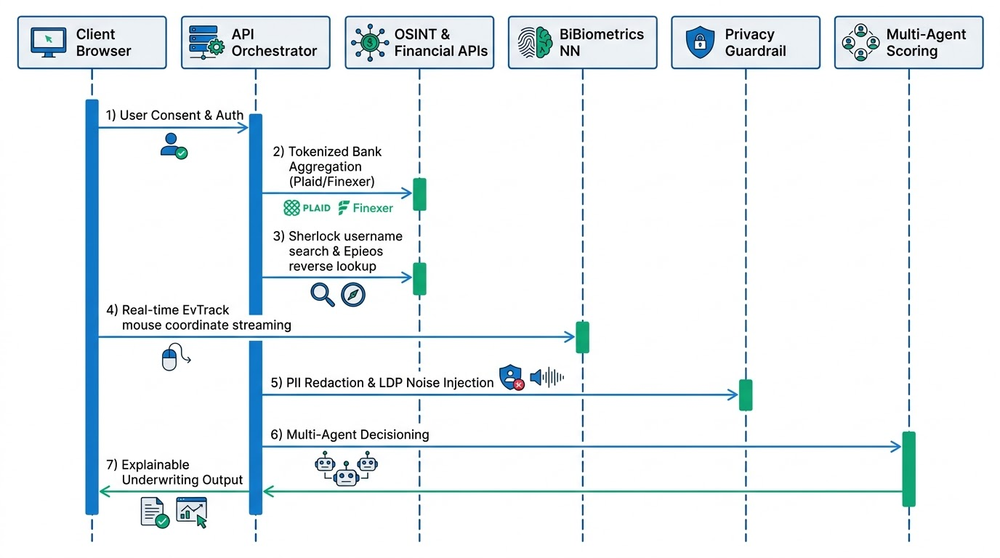
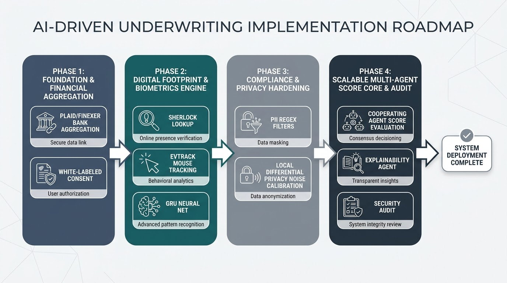

# Frontier Underwriting: AI-Driven Dynamic Underwriting Engine

> **Rethinking Credit Risk Assessment:** A production-ready, privacy-preserving alternative to traditional credit bureau scores. By leveraging real-time consent-first Open Finance APIs, modular OSINT footprint mapping, and client-side behavioral biometrics, *Frontier Underwriting* computes a continuous, dynamic risk score while strictly respecting data sovereignty and regulatory frameworks.

---

## 🌟 Key Strategic Differentiators

This system is built from the ground up to address the real-world operational, security, and compliance challenges that prevent large financial institutions from adopting basic "AI wrappers".

1. **Massive Operational Cost-Efficiency (Cooperating Agents)**  
   Instead of routing every routing check through a massive commercial LLM, our orchestrator chains lightweight local classifiers (Random Forest, custom regex) for routine checks and only escalates to expensive reasoning models for high-stakes credit decisions. This minimizes **cost-per-decision** at enterprise scale.
2. **Cutting-Edge Security (Behavioral Biometrics)**  
   Detects automated botting, coordinate spoofing, and cognitive stress in real-time by feeding client-side mouse trajectory sequences `(x, y, t)` into a local **Bidirectional GRU** neural network.
3. **Enterprise Bank Integration**  
   Implements tokenized, credential-free Open Finance integrations (modeled after **Plaid** and **Finexer**), ensuring that the backend aggregates real-time transactions without ever touching or storing user bank credentials.
4. **Legally Bulletproof (Sovereignty & Privacy)**  
   Includes a white-labeled Consent Management dashboard. Automatically redacts sensitive parameters using syntax-based filters (Regex) and protects collaborative banking models using **Local Differential Privacy (LDP)** calibrated noise perturbation.
5. **Regulatory Explainability**  
   A dedicated **Explainability Agent** translates complex mathematical risk vectors into plain-language, audit-ready justifications that customers and regulators can instantly verify.

---

## 🏗️ System Architecture

Our modular, microservice-driven architecture divides the dynamic underwriting pipeline into five robust, decoupled engineering blocks:

.png)

*This schematic visualizes the physical coordination of our Client Portal, Central API Orchestrator, Financial Data Aggregators, OSINT Mining, Behavioral Biometrics, Privacy Guardrails, and Cooperating Scoring Agents.*

---

## 🔄 End-to-End Underwriting Workflow

To eliminate the risks of high-latency, un-consented, and non-explainable decision systems, *Frontier Underwriting* executes the dynamic credit scoring process through a highly structured, asynchronous client-server event timeline:

### Sequence Milestones:
1. **Explicit Consent & Auth Token Generation:** The portal captures granular, time-bound consent permissions, initiating a secure, tokenized communication path with our backend microservices.
2. **Parallel Ingestion Pipeline:** While Open Banking APIs retrieve categorized cash-flow statements, the background OSINT module executes concurrent domain lookups to verify employment timelines.
3. **Continuous Interaction Tracking:** As the customer completes the application form, client-side biometrics continuously poll physical trajectory points, passing them to localized classification models.
4. **Guardrail Redaction & Privacy Hardening:** Telemetry datasets and text payloads pass through privacy filter gates to redact sensitive traits and inject mathematical LDP noise before decisions are made.
5. **Dynamic Scoring & Self-Check:** Specialized agents analyze risk dimensions in parallel, validating the synthesized credit adjust score against business goals before publishing.

---

## ⚙️ Core Technical Specifications: AI-Driven Dynamic Underwriting System (AIDUS)

### 1. System Onboarding & Consent-First Financial Aggregation [5, 10]

The strategic evolution of underwriting requires a paradigm shift from reliance on latent, historical credit bureau data to the capture of "data exhaust"—real-time, high-fidelity signals generated by a consumer's active financial life. By prioritizing transparency and a consent-first architecture, the AI-Driven Dynamic Underwriting System (AIDUS) builds fundamental trust, moving away from "black box" credit scoring toward a collaborative data relationship. This transition is not merely a compliance requirement but a strategic necessity to secure the high-quality, real-time financial data required for modern risk modeling.

AIDUS leverages the Finexer Open Finance framework to architect a seamless onboarding workflow. The system integrates tokenized, credential-free APIs to facilitate bank account access without the security risk of handling user-entered login credentials. A critical technical differentiator is the integration of Finexer’s Balance Enrichment Engine, which reconstructs running balances even in instances where financial institutions fail to provide them, ensuring a complete and reconciled financial picture.

**Consent Management Protocol**

| User UX Action | Backend Consent Management (Revocation/Expiration) | Strong Customer Authentication (SCA) Requirements |
|---|---|---|
| Invitation Link Acceptance | API-driven generation of unique consent tokens mapped to specific account scopes. | Bank-native SCA via OIDC/OAuth flow. |
| Branded Consent Approval | Deployment of white-label HTML/CSS consent screens to maintain brand continuity and user trust. | Redirect to bank-authorized biometric or SMS-based verification. |
| Re-Consent Trigger | Expiration Management: Automated re-consent triggers and reminders sent via API prior to token expiry. | Re-authentication through bank-secure channels to ensure uninterrupted data flow. |
| Access Revocation | Revocation Logic: Immediate nullification of API tokens and session termination with automated payload suspension. | Backend audit logging for BSA/AML and regulatory scrutiny. |

By utilizing real-time balance checks and automated transaction categorization, AIDUS effectively mitigates fraud risks associated with static, easily manipulated bureau reports. This intake provides a foundational layer of verified financial capability, which must then be correlated with the applicant’s broader digital existence.

### 2. Automated OSINT Footprint Pipeline [11, 14]

Verifying digital-only identities in an era of synthetic fraud requires a unified, modular framework that eliminates the latency of manual correlation. OSINT (Open-Source Intelligence) serves as a strategic verification layer, establishing a "Trust-Score" by cross-referencing disparate digital signals to prove an identity is real, historically consistent, and professionally active.

AIDUS implements a Modular Intelligence Architecture based on the JETIR framework to automate this discovery:

* **Social Intelligence:** Automated username discovery using Sherlock and other social-media-finder modules to establish the depth and longevity of the applicant’s social footprint.
* **Identity Verification:** Direct integration with Digiverifier for real-time validation of Aadhaar, PAN, and GST. Crucially, the system performs a UAN (Universal Account Number) check to verify employment history and income consistency, serving as a primary defense against employment fraud and "Caste Certificate Fraud" as highlighted in the Digiverifier context.
* **Data Leak Mapping:** Identifiers are cross-referenced against leak metadata repositories (e.g., HaveIBeenPwned) to evaluate "Footprint Longevity." An identity found in a 5-year-old breach is significantly more verifiable than a "clean" identity created 48 hours prior to an application.

**Correlation Engine Logic**

The Correlation Engine bridges identifiers to eliminate fragmented intelligence:

1. **Seed Input:** The process begins with primary identifiers (Email, Phone, or Username).
2. **Platform Mapping:** Usernames are queried across social and professional platforms to evaluate "network depth."
3. **Breach History:** Emails are checked against breach records to establish the historical "shadow" of the identity.
4. **Professional Synthesis:** Signals from LinkedIn and professional directories are correlated with government ID data and UAN records to ensure the applicant’s declared career trajectory is authentic.

This verified digital identity provides the context necessary to interpret real-time behavioral signals captured during the application process.

### 3. In-Page Behavioral Biometrics & Device Fingerprinting [1, 8]

"Invisible Security" is the strategic vanguard against automated bots and synthetic identity fraud. By analyzing high-frequency kinetic data, AIDUS detects human-intent anomalies that static verification cannot see. The goal is to verify not just who the user says they are, but that the entity interacting with the page is a sentient human with legitimate intent.

The system utilizes the EvTrack coordinate polling module, specified at a high-frequency 150ms interval to capture raw mouse trajectories and touch interactions. This kinetic data is processed by a dual-model architecture:

* **BiGRU (Bidirectional Gated Recurrent Unit):** This model performs temporal/sequential analysis of raw mouse trajectories, identifying the rhythmic patterns unique to human motor control vs. the linear, perfectly efficient movements of a bot.
* **Random Forest:** This model is utilized for categorical and demographic modeling, classifying aggregated kinetic features (such as mean velocity, acceleration, and jitter) to identify fraud probability scores based on historical behavioral signatures.

To ensure "Environment Integrity," AIDUS employs Canvas, WebGL, and WebRTC fingerprinting to identify unique device configurations. This browser-side signal is synthesized with the server-side Conversion API (CAPI) approach. Using event_id logic, AIDUS deduplicates events firing from both the browser and server, ensuring high data accuracy and cross-platform deduplication even when browser-based tracking is restricted. These behavioral signals are carefully anonymized before entering the privacy-preserving compliance layer.

### 4. GDPR & Indian Data Protection Compliance Guardrails [3, 6]

As a CTO, balancing model utility with the "Right to Privacy" is a strategic imperative under the Bharatiya Nyaya Sanhita (BNS) and GDPR frameworks. AIDUS addresses this through the DPFedBank Local Differential Privacy (LDP) implementation, ensuring that data is perturbed at the source before transmission.

**Local Differential Privacy (LDP) Implementation**

Noise is calibrated to satisfy $(\epsilon, \delta)$-Local Differential Privacy. The noise scale $(\sigma)$ is defined as: $\sigma \geq \Delta/\epsilon$ where $\epsilon$ represents the Privacy Budget and $\Delta$ is the sensitivity of the local model updates. To enforce the sensitivity limit, AIDUS implements Gradient Clipping, bounding the influence of any single data point. The system employs a Privacy Budget Allocation Method to monitor cumulative privacy loss over time, preventing budget exhaustion and ensuring long-term model integrity.

**Privacy-Enhancing Guardrails**

* **Regex Redaction:** Automated PII removal before data enters agentic processing cores.
* **Minor Exclusions:** Filtering logic to prevent the model from using protected characteristics (age, sex, caste) as proxy signals for risk.
* **Noise Calibration:** Application of LDP Gaussian noise to obfuscate individual data points while maintaining global model accuracy via the law of large numbers.

AIDUS further utilizes Secure Multi-Party Computation (SMPC) and Homomorphic Encryption for all data-in-transit. This protects the system against "Meet-in-the-Middle" attacks by allowing the central aggregator to compute results on encrypted updates without ever seeing the underlying raw data.

### 5. Cooperating Multi-Agent Underwriting Core [4, 12]

AIDUS adopts the paradigm of "Agentic Commerce," a shift seen in DSPs and ad exchanges in the mid-2020s, by deploying specialized LLM agents rather than a monolithic model. This modularity ensures specialized reasoning and regulatory-grade explainability.

**The Cooperating Agent Network**

* **Cash-Flow Agent:** Evaluates Finexer-derived transaction patterns, running balances, and income consistency.
* **OSINT Agent:** Validates professional history and UAN-verified employment signals.
* **Biometrics Agent:** Analyzes sequential BiGRU trajectories and kinetic signatures to detect bot activity.
* **Self-Check Agent:** Audits outputs against Business Impact goals (20% AI Depth weighting). Crucially, this agent calculates and reports the "Cost-per-Decision" based on the model tier utilized (RAG vs. Commercial LLM).
* **Explainability Agent:** Converts complex weights and alternative data signals into "plain-language" rationales for regulators and consumers.

**Dynamic Adjustment Mechanism**

AIDUS uses these alternative signals to dynamically adjust the traditional baseline bureau score. In alignment with our Build Principles, we prioritize smaller, open-source models and RAG over commercial LLMs to minimize the cost-per-decision while maximizing reasoning depth. This agentic core allows AIDUS to update risk scores continuously, evolving as the customer’s financial behavior and digital footprint change over time.

---

## 📅 Product Implementation Roadmap

To establish a highly structured path to market-readiness, our implementation is partitioned into a **four-phase engineering roadmap**:

*   **Phase 1 (Foundation & Financial Aggregation):** Connect credential-free data links and configure the OAuth consent portal.
*   **Phase 2 (Footprint Mining & Biometrics):** Deploy concurrent Sherlock OSINT routines and train the localized TensorFlow GRU network.
*   **Phase 3 (Compliance & Privacy Hardening):** Build regex PII filters and implement Local Differential Privacy (LDP) noise perturbers inside secure hardware enclaves (such as Intel SGX).
*   **Phase 4 (Multi-Agent Score & Audit):** Wire the co-operating agent decision core, implement plain-language explainability, and execute third-party SOC 2 and compliance testing.

---

## 🛡️ License

This project is licensed under the Apache License 2.0 - see the [LICENSE](LICENSE) file for details.

---

*This system was developed as a competitive hackathon MVP submission to showcase how financial institutions can safely evolve credit underwriting beyond static bureau scores, utilizing behavioral analytics without compromising user data sovereignty.*

## 📚 References

1. Arapakis, I., & Leiva, L. A. (2020). The Attentive Cursor Dataset [Data set]. GitLab. https://gitlab.com/iarapakis/the-attentive-cursor-dataset
2. Digiverifier. (2026). Digital employee background verification: Aadhaar, PAN, and UAN cross-referencing methodologies. Digiverifier. https://www.digiverifier.com/
3. Dwork, C., & Roth, A. (2014). The algorithmic foundations of differential privacy. Foundations and Trends in Theoretical Computer Science, 9(3–4), 211–407. https://doi.org/10.1561/0400000042
4. Farke, F. M., Balash, D. G., Golla, M., & Aviv, A. J. (2024). How does connecting online activities to advertising inferences impact privacy perceptions? Proceedings on Privacy Enhancing Technologies, 2024(2), 372–390. https://doi.org/10.56553/popets-2024-0055
5. Finexer. (2026). Finexer Data Aggregation and Real-Time Statement Verification APIs. Finexer Ltd. https://finexer.com/verification
6. He, P., Lin, C., & Montoya, I. (2024). DPFedBank: Crafting a privacy-preserving federated learning framework for financial institutions with policy pillars. arXiv. https://arxiv.org/abs/2101.05428
7. Leiva, L. A. (2021). MouseFaker: A Chrome extension to distort mouse cursor coordinates on the fly [Computer software]. GitHub. https://github.com/luileito/mousefaker
8. Leiva, L. A., Arapakis, I., & Iordanou, C. (2021). My mouse, my rules: Privacy issues of behavioral user profiling via mouse tracking. In Proceedings of the 2021 ACM SIGIR Conference on Human Information Interaction and Retrieval (CHIIR '21) (pp. 1–11). ACM. https://doi.org/10.1145/3406522.3446011
9. Oracle Financial Services. (2024). UK Open Banking Consent Management User Guide: Oracle Banking Digital Experience (Patchset Release 22.2.4.0.0, Part No. F72987-01). Oracle Corporation. https://www.oracle.com/financialservices/
10. Plaid. (2026). How Plaid handles your personal financial data: Security, encryption and consumer permissions. Plaid Inc. https://plaid.com/safety
11. Soni, P., & Mathur, N. (2025). A unified OSINT framework for multi-domain cybercrime investigation. Journal of Emerging Technologies and Innovative Research (JETIR), 12(12), d201–d205. https://www.jetir.org/
12. Student Problem Statement. (2026). AI-Driven Dynamic Underwriting Using Alternative Data (Track 10 Evaluation Rubric & System Design Principles). Hackathon Problem Statements.
13. Tessl. (2026). social-media-finder-skill: Automated social media profile discovery via BrowserAct API [Computer software]. GitHub. https://github.com/browser-act/skills
14. Username Taken Somewhere? Sherlock Project. (2026). Sherlock: Hunt down usernames across 400+ social platforms [Computer software]. GitHub. https://github.com/sherlock-project/sherlock
15. Zymr Inc. (2025). Open Banking API Development: Key Features & Best Practices. https://www.zymr.com/api-development-services
